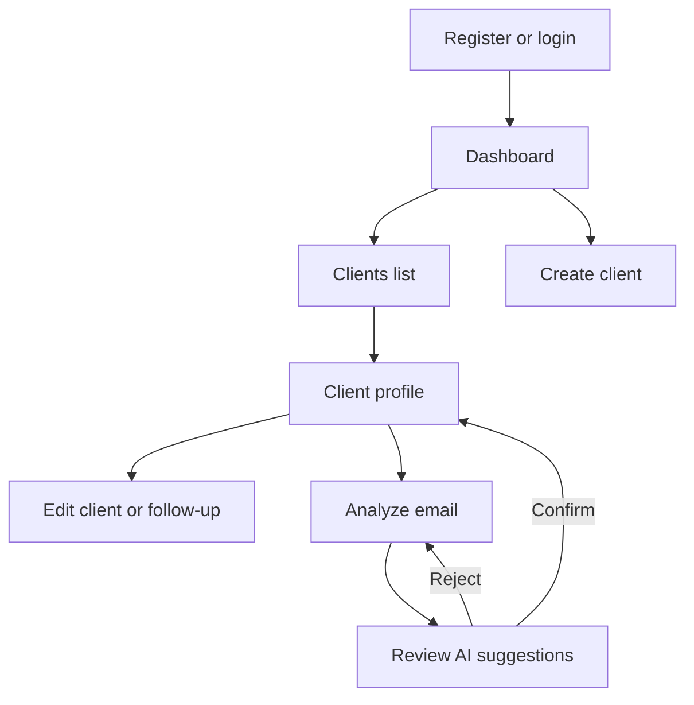

# ClientCare — Main Page Wireframes

## Purpose

These wireframes define the information hierarchy and navigation of the ClientCare MVP before implementation. They intentionally focus on structure, priority and user actions rather than final visual polish.

## Application flow

## Shared application shell

### Desktop

- A 240px left sidebar contains the logo and primary navigation.
- A compact top bar displays the current page context and coordinator menu.
- Main content uses a maximum width and comfortable spacing.
- The primary page action is positioned in the upper-right of the page header.

Primary navigation:

1. Dashboard
2. Clients
3. Analyze email

Secondary navigation:

- Account
- Logout

### Mobile

- The sidebar becomes a drawer.
- The header contains a menu button, page title and primary action.
- Tables become stacked client cards.
- Forms use one column.

## Screen 1 — Register

### Goal

Allow a coordinator to create an account with minimal friction.

### Layout

- Centered ClientCare brand.
- Short product promise.
- Name field.
- Email field.
- Password field.
- Confirm password field.
- Primary **Create account** button.
- Link to login.

### States

- default;
- client-side validation errors;
- duplicate email error;
- loading;
- success and redirect.

## Screen 2 — Login

### Goal

Authenticate a returning coordinator.

### Layout

- Centered card on a calm background.
- ClientCare logo and welcome message.
- Email field.
- Password field.
- Primary **Log in** button.
- Link to registration.
- Generic authentication error area.

## Screen 3 — Dashboard

### Goal

Answer: “Who needs my attention now?”

### Page header

- Title: **Dashboard**
- Short date or greeting.
- Primary action: **Add client**
- Secondary action: **Analyze email**

### Summary cards

1. Overdue follow-ups
2. Due today
3. Active clients
4. Not scheduled

### Priority list

Columns:

- Client
- Last contact
- Next follow-up
- Status
- Action

Sorting:

1. most overdue;
2. due today;
3. nearest upcoming follow-up.

Each row includes **View profile**. Red is reserved for overdue status labels and counts, not the entire row.

### Empty state

If no clients require attention, show a calm confirmation message and a link to all clients.

## Screen 4 — Clients list

### Goal

Browse and open client profiles.

### Page header

- Title: **Clients**
- Primary action: **Add client**

### MVP content

- Client table.
- Name.
- Email.
- Last contact.
- Next follow-up.
- Follow-up status.
- Open-profile action.

Search and status filters are reserved as additional features. Their future placement is above the table so they can be added without changing the page architecture.

## Screen 5 — Client profile

### Goal

Understand the client and update the next follow-up quickly.

### Header

- Client name.
- Active or archived label.
- **Edit client** action.
- **Archive client** action in a secondary menu.

### Main column

- Situation summary.
- Identified needs.
- Missing information.
- Suggested next action.

### Follow-up panel

- Follow-up status.
- Last-contact date.
- Next-follow-up date.
- Days overdue when applicable.
- **Update follow-up** action.
- **Analyze email** action.

### Contact panel

- Email.
- Phone.
- Created date.
- Last updated date.

## Screen 6 — Create or edit client

### Goal

Create or update a profile without overwhelming the coordinator.

### Sections

**Identity**

- First name
- Last name
- Email
- Phone, optional

**Situation**

- Short summary, optional

**Follow-up**

- Last-contact date, optional
- Next-follow-up date, optional

### Actions

- Primary: **Save client**
- Secondary: **Cancel**

The create and edit pages reuse the same form component.

## Screen 7 — Analyze email

### Goal

Turn fictional email content into reviewable structured suggestions.

### Input state

- Client context at the top.
- Privacy reminder: fictional demonstration data only.
- Large email-content text area.
- Primary **Analyze with Gemini** button.
- Clear loading state.
- Error area that preserves the pasted text.

### Rules

- Empty text cannot be submitted.
- No AI output is saved automatically.
- The API key is never exposed in the browser.

## Screen 8 — Review AI suggestions

### Goal

Make the human confirmation step explicit and unavoidable.

### Header

- Label: **AI-generated suggestions**
- Verification warning.

### Editable fields

- Summary
- Identified needs
- Missing information
- Suggested next action

### Actions

- Primary: **Confirm and save**
- Secondary: **Reject suggestions**
- Tertiary: **Back to email**

The confirmation action records only the values visible in the editable fields.

## Responsive behavior

| Desktop pattern | Mobile adaptation |
| --- | --- |
| Fixed sidebar | Drawer opened from header |
| Four summary cards | Two-column grid, then one column on very narrow screens |
| Client table | Stacked client cards |
| Two-column profile | Main content followed by follow-up panel |
| Inline form fields | Single-column fields |
| Side-by-side review actions | Full-width stacked actions |

## Accessibility behavior

- Logical heading order.
- Keyboard-accessible navigation and controls.
- Visible focus states.
- Explicit form labels.
- Status conveyed by icon, text and color.
- Form errors associated with their fields.
- Important asynchronous feedback announced politely.

## Wireframe decisions

1. The dashboard prioritizes action rather than analytics.
2. Overdue information is prominent but visually contained.
3. Client profile and follow-up information remain visible together.
4. AI analysis and human review are separate screen states.
5. Creation and editing share one form architecture.
6. Additional features can be added without redesigning the MVP navigation.

## Task 4 completion criteria

- Authentication screens defined: complete.
- Dashboard structure defined: complete.
- Client list and profile defined: complete.
- Client form defined: complete.
- AI analysis and review defined: complete.
- Desktop and mobile behavior defined: complete.
- Accessibility behavior defined: complete.

