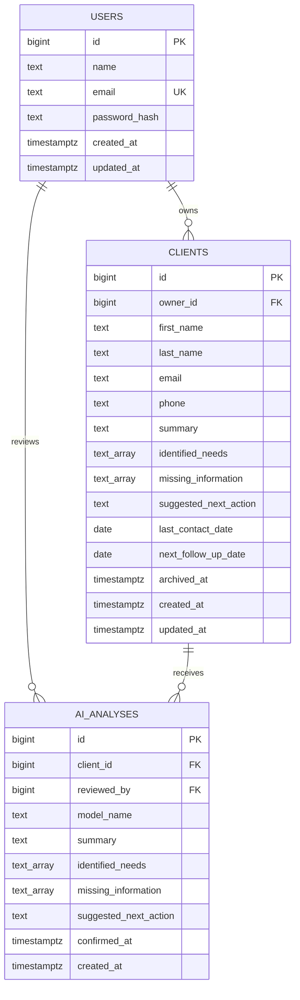

# ClientCare — Database Structure

## Objective

The database must support the smallest complete ClientCare workflow:

- authenticate a coordinator;
- create and manage client profiles;
- calculate follow-up urgency from dates;
- save only human-confirmed AI suggestions;
- archive clients without deleting their history.

## Entity relationship diagram



## Table: `users`

Stores coordinator accounts.

| Column | Type | Rules |
| --- | --- | --- |
| `id` | `bigint identity` | Primary key |
| `name` | `text` | Required, trimmed, minimum two characters |
| `email` | `text` | Required, lowercase, unique |
| `password_hash` | `text` | Required; never contains a plain-text password |
| `created_at` | `timestamptz` | Defaults to current time |
| `updated_at` | `timestamptz` | Updated automatically |

The application normalizes the email to lowercase before insertion. The database also enforces lowercase storage.

## Table: `clients`

Stores the current, human-approved client profile.

| Column | Type | Rules |
| --- | --- | --- |
| `id` | `bigint identity` | Primary key |
| `owner_id` | `bigint` | Required foreign key to `users.id` |
| `first_name` | `text` | Required and non-empty |
| `last_name` | `text` | Required and non-empty |
| `email` | `text` | Required and normalized to lowercase |
| `phone` | `text` | Optional |
| `summary` | `text` | Optional human-approved summary |
| `identified_needs` | `text[]` | Empty array by default |
| `missing_information` | `text[]` | Empty array by default |
| `suggested_next_action` | `text` | Optional human-approved action |
| `last_contact_date` | `date` | Optional |
| `next_follow_up_date` | `date` | Optional |
| `archived_at` | `timestamptz` | `null` while active |
| `created_at` | `timestamptz` | Defaults to current time |
| `updated_at` | `timestamptz` | Updated automatically |

A client is archived by setting `archived_at`. Normal application actions never permanently delete a client.

Shared family email addresses are possible, so client email is indexed but not unique.

## Table: `ai_analyses`

Stores confirmed analysis results for audit and history.

| Column | Type | Rules |
| --- | --- | --- |
| `id` | `bigint identity` | Primary key |
| `client_id` | `bigint` | Required foreign key to `clients.id` |
| `reviewed_by` | `bigint` | Required foreign key to `users.id` |
| `model_name` | `text` | Gemini model used |
| `summary` | `text` | Confirmed content |
| `identified_needs` | `text[]` | Confirmed list |
| `missing_information` | `text[]` | Confirmed list |
| `suggested_next_action` | `text` | Confirmed action |
| `confirmed_at` | `timestamptz` | Human-confirmation time |
| `created_at` | `timestamptz` | Record-creation time |

The original email body is not stored in this table. This reduces unnecessary retention of potentially sensitive content.

Rejected AI suggestions create no database record.

## Follow-up state

Follow-up state is calculated dynamically and is never manually stored:

```sql
case
  when archived_at is not null then 'archived'
  when next_follow_up_date is null then 'not_scheduled'
  when next_follow_up_date < current_date then 'overdue'
  when next_follow_up_date = current_date then 'due_today'
  else 'upcoming'
end
```

This prevents a stored status from disagreeing with the date.

## Required indexes

| Index | Purpose |
| --- | --- |
| Unique index on `users.email` | Login lookup and duplicate prevention |
| Index on `clients.owner_id` | Retrieve one coordinator's clients |
| Partial index on active client email | Faster active-client lookup |
| Partial composite index on `owner_id, next_follow_up_date` | Dashboard follow-up query |
| Index on `ai_analyses.client_id, created_at` | Analysis history by client |
| Index on `ai_analyses.reviewed_by` | Indexed foreign key and audit lookup |

PostgreSQL does not automatically index foreign-key columns, so every foreign key used for regular lookup receives an explicit index.

## AI confirmation transaction

When a coordinator confirms an analysis, the server performs one database transaction:

1. Verify that the client belongs to the authenticated coordinator.
2. Insert the approved values into `ai_analyses`.
3. Update the approved summary fields on `clients`.
4. Commit both changes together.

If any step fails, the transaction is rolled back so the profile and analysis history cannot disagree.

## Ownership rule

Every protected client query must include the authenticated coordinator ID:

```sql
where clients.owner_id = $authenticated_user_id
```

Knowing a client ID alone must never grant access to the profile.

## Naming and type decisions

- Lowercase `snake_case` identifiers avoid quoting and ORM compatibility problems.
- `bigint generated always as identity` provides efficient sequential primary keys.
- `timestamptz` is used for timestamps.
- `date` is used for day-level follow-up dates.
- `text` is preferred over arbitrary `varchar` limits.
- Check constraints protect essential invariants.
- The application database account must not be a PostgreSQL superuser.

## Deferred tables

The following tables are intentionally excluded from the MVP schema:

- interactions;
- tasks;
- email templates;
- coordinator assignments;
- external notifications;
- refresh-token sessions.

They can be added without changing the three-table core.

## Task 5 completion criteria

- Core entities defined: complete.
- Relationships defined: complete.
- Field types and constraints defined: complete.
- Follow-up calculation defined: complete.
- Index strategy defined: complete.
- AI confirmation storage defined: complete.
- Privacy retention decision defined: complete.

